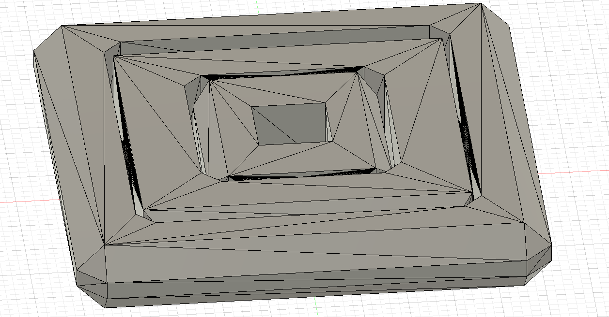
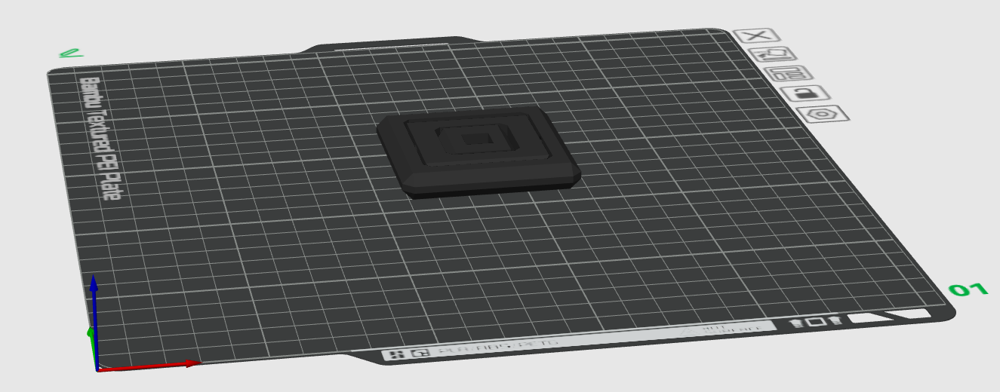

# Fidget-toy
A Blueprint project to make a 3d-printable fidget toy of my own!

---

### CAD Model

### 3D Printing Model

---

## Printing Notes
- Recommended material: PLA! Amount of filament depends on the scale you print at, for me it took around 20g :D
- No supports required (but does depend on the printer).
- Layer height: 0.2 mm

---

## BOM
- No funding needed since I have the filament!